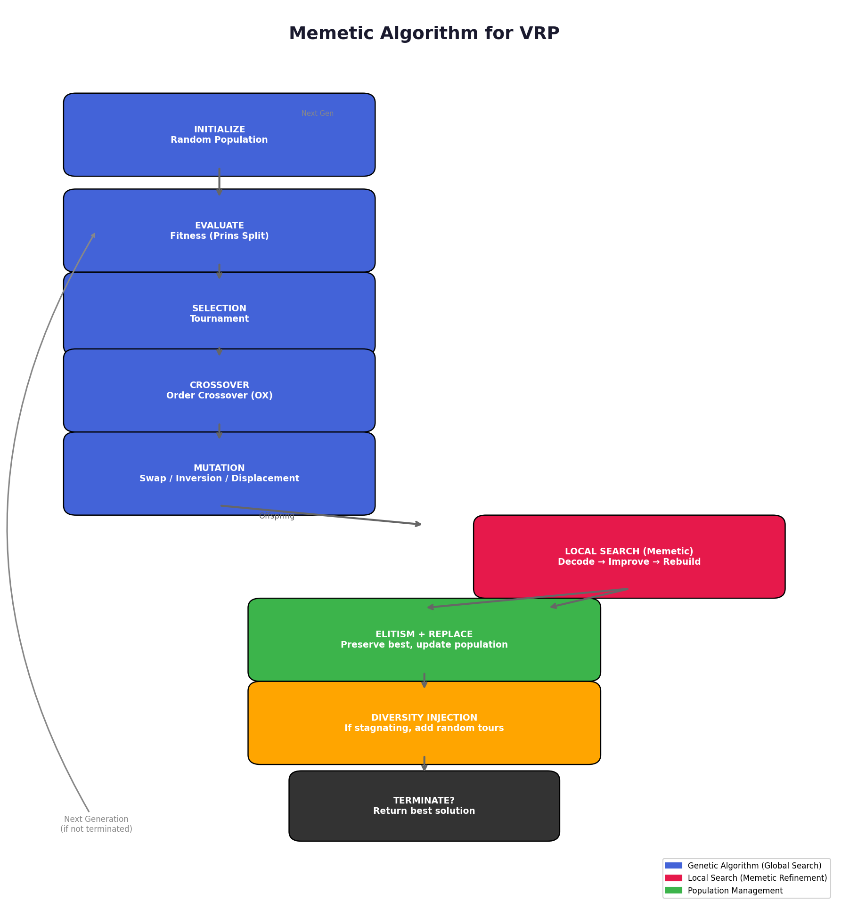
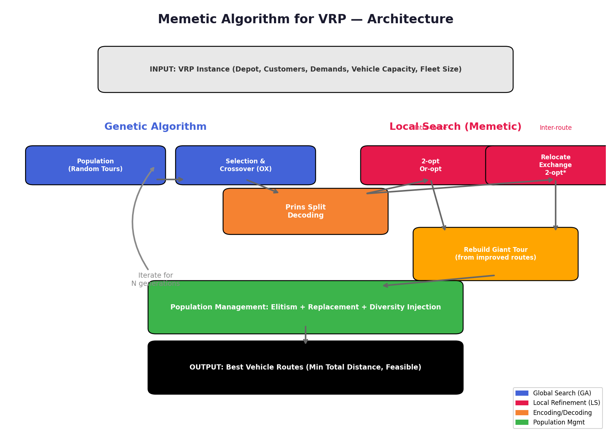
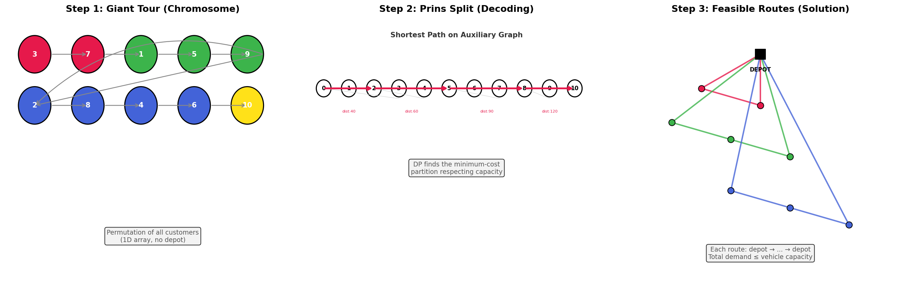
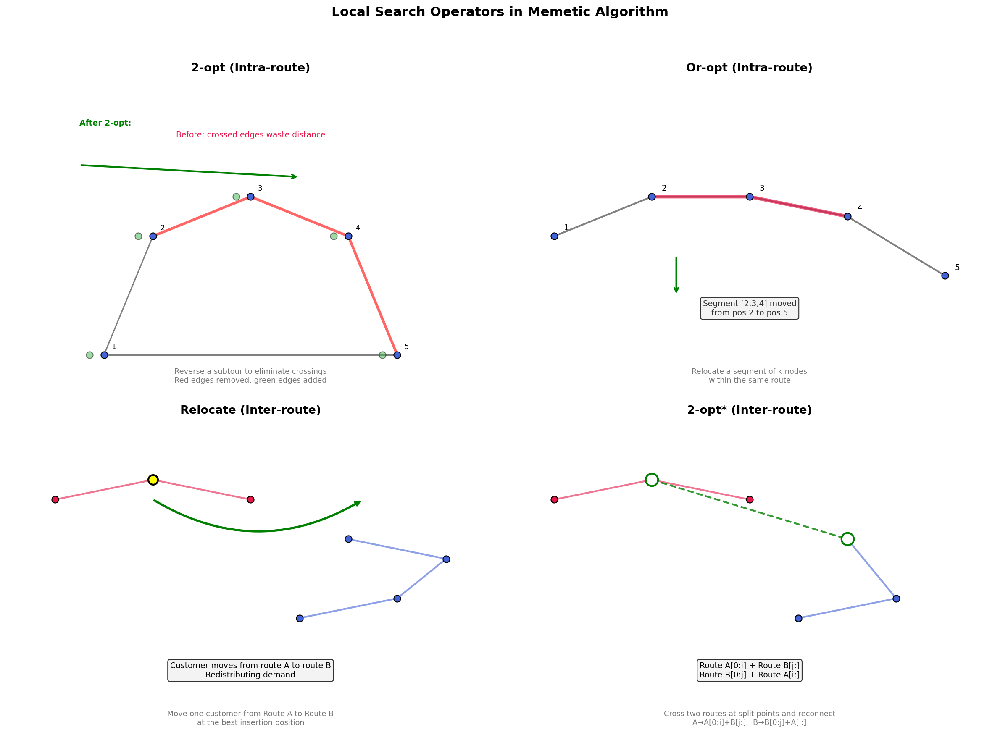

# Memetic Algorithm for the Capacitated Vehicle Routing Problem (CVRP)

## Technical Documentation

---

## Table of Contents

1. [Problem Definition](#1-problem-definition)
2. [Why Memetic Algorithm for VRP?](#2-why-memetic-algorithm-for-vrp)
3. [Algorithm Architecture](#3-algorithm-architecture)
4. [Representation & Encoding](#4-representation--encoding)
5. [Genetic Algorithm Components](#5-genetic-algorithm-components)
6. [Local Search Operators (The Memetic Component)](#6-local-search-operators-the-memetic-component)
7. [Diversity Management](#7-diversity-management)
8. [Implementation Details](#8-implementation-details)
9. [Results & Analysis](#9-results--analysis)
10. [Code Structure](#10-code-structure)
11. [References](#11-references)

---

## 1. Problem Definition

### The Capacitated Vehicle Routing Problem (CVRP)

The CVRP is a combinatorial optimization problem defined as follows:

- There is **1 depot** (warehouse) where all vehicles are stationed
- There are **N customers**, each located at coordinates (x_i, y_i) with demand d_i
- There are **K vehicles**, each with identical capacity Q
- Each customer must be visited **exactly once** by exactly one vehicle
- Every vehicle route **starts and ends** at the depot
- The total demand on any route must **not exceed** the vehicle capacity Q
- **Objective**: minimize the total travel distance across all routes

```
        Customer 3
           ●
          / \
         /   \         Customer 5
   Depot ■    \            ●
         \     \          /
          \     ●--------●
           \   /  Customer 4
            \ /
        Customer 2 ●
```

The CVRP generalizes the Traveling Salesman Problem (TSP). While TSP asks for a single optimal tour visiting all cities, CVRP asks for multiple optimal tours (routes) that collectively visit all customers while respecting capacity constraints. CVRP is **NP-hard**.

---

## 2. Why Memetic Algorithm for VRP?

### Metaheuristic Approach

Exact methods (branch-and-cut, column generation) can solve small VRP instances optimally but become computationally intractable for larger instances. Heuristics and metaheuristics offer a practical trade-off between solution quality and computation time.

### The Memetic Advantage

A **Memetic Algorithm (MA)** combines:

| Component | Role | Metaphor |
|-----------|------|----------|
| **Genetic Algorithm** | Global exploration of the search space | Biological evolution (genes crossing over, mutating) |
| **Local Search** | Intensive refinement of individual solutions | Cultural/memetic evolution (learning, practice, improvement) |

This dual approach is particularly effective for VRP because:

1. The search space of possible route configurations is enormous (O(N!))
2. A pure GA would take too long to converge on high-quality solutions
3. Pure local search (like a greedy heuristic) would get stuck in local optima
4. The combination allows the GA to **explore** broadly while the local search **exploits** promising regions

### Diagram: Memetic Algorithm Flowchart



---

## 3. Algorithm Architecture



The algorithm operates in a loop over generations, with each generation consisting of:

```
┌──────────────────────────────────────────────────────────────┐
│                    ONE GENERATION CYCLE                      │
├──────────────────────────────────────────────────────────────┤
│  1. EVALUATE   →  Compute fitness for each individual        │
│  2. SELECT     →  Tournament selection (pick parents)        │
│  3. CROSSOVER  →  Order Crossover (OX) to produce offspring  │
│  4. MUTATE     →  Swap / Inversion / Displacement mutations  │
│  5. LOCAL      →  Apply 2-opt, Or-opt, Relocate, Exchange,   │
│     SEARCH         2-opt* to refine a subset of offspring    │
│  6. REPLACE    →  Elitism (keep best) + replace worst        │
│  7. DIVERSITY  →  Inject random tours if stagnation detected │
└──────────────────────────────────────────────────────────────┘
```

---

## 4. Representation & Encoding

### The Giant Tour

Each individual in the population is represented as a **permutation of all N customers** — called a **giant tour** or **chromosome**:

```
Chromosome:  [3, 7, 1, 5, 9, 2, 8, 4, 6, 10]
               ↑  ↑  ↑  ↑  ↑  ↑  ↑  ↑  ↑   ↑
             Customer indices (no depot)
```

The depot is **not** part of the chromosome. It is implicitly inserted at the start and end of every route.

### Prins' Split Algorithm

To convert a giant tour into a feasible set of routes, we use the **split algorithm** proposed by Prins (2004):

1. Construct an **auxiliary directed acyclic graph** with N+1 nodes (0 to N)
2. For each edge (i, j) where i < j:
   - Check if the demand of customers in positions i+1 through j fits within vehicle capacity Q
   - If feasible, the edge weight = cost of route: depot → tour[i+1] → ... → tour[j] → depot
3. Find the **shortest path** from node 0 to node N using dynamic programming
4. The edges on the shortest path define the **split points** of the giant tour into routes

```
Giant Tour:    [3, 7, 1, 5, 9, 2, 8, 4, 6, 10]
                  V1       V2         V3         V4
Split points:  0 ──→ 2 ──→ 5 ──→ 8 ──→ 10

Routes:
  V1: depot → 3 → 7 → depot       (customers 3, 7)
  V2: depot → 1 → 5 → 9 → depot   (customers 1, 5, 9)
  V3: depot → 2 → 8 → 4 → depot   (customers 2, 8, 4)
  V4: depot → 6 → 10 → depot      (customers 6, 10)
```

**Complexity**: O(N²) per evaluation, where N is the number of customers.

### Diagram: Encoding & Decoding



---

## 5. Genetic Algorithm Components

### 5.1 Tournament Selection

Selects parents for reproduction via a "mini-competition":
1. Randomly pick **k** (typically 3-5) individuals from the population
2. Choose the one with the **best (lowest) fitness** as the parent

This balances selection pressure (higher k = more selective) with diversity (lower k = more random).

### 5.2 Order Crossover (OX)

Order Crossover preserves the relative order of genes while combining information from two parents:

```
Parent 1:  [3, 7, 1, 5, 9, 2, 8, 4, 6]
Parent 2:  [5, 2, 9, 8, 3, 1, 6, 4, 7]

Step 1: Pick a random segment from Parent 1
         [3, 7, |1, 5, 9,| 2, 8, 4, 6]
                  ↑ segment ↑

Step 2: Copy segment to child
Child:    [_, _, 1, 5, 9, _, _, _, _]

Step 3: Fill remaining positions from Parent 2 in order, skipping genes already present
Parent 2: [5, 2, 9, 8, 3, 1, 6, 4, 7]
           ↓     skip     ↓  ↓  ↓  ↓
Fill:      [2, 8, 1, 5, 9, 3, 6, 4, 7]

Child:    [2, 8, 1, 5, 9, 3, 6, 4, 7]
```

### 5.3 Mutation Operators

| Operator | Description | Example |
|----------|-------------|---------|
| **Swap** | Exchange two random positions | [1,2,3,4] → [1,4,3,2] |
| **Inversion** | Reverse a random subsequence | [1,2,3,4] → [1,4,3,2] |
| **Displacement** | Move a subsequence to a new position | [1,2,3,4] → [1,4,2,3] |

Mutation probability: 15%

---

## 6. Local Search Operators (The Memetic Component)

The local search is applied to a fraction (15%) of the population each generation. It accepts only **improving** moves (first-accept strategy with delta evaluation).

### Diagram: Local Search Operators



### 6.1 Intra-Route Operators (within a single route)

#### 2-opt
Eliminates route crossings by reversing a subsequence:

```
Before:  depot → A → B → C → D → E → depot
                    \   /
                      X        (crossing wastes distance)
                    /   \
After:   depot → A → B → D → C → E → depot  (uncrossed)
```

**Delta evaluation**: Instead of recomputing the full route cost, only compute the change from removing edges (B,C) and (D,E) and adding edges (B,D) and (C,E). Reduces computation from O(L) to O(1) per move.

#### Or-opt
Relocates a short segment (default length 3, then tries 2, then 1) to a better position within the same route:

```
Before:  A → [B → C → D] → E → F
         [segment]
After:   A → E → [B → C → D] → F
         (segment moved to better position)
```

### 6.2 Inter-Route Operators (between different routes)

#### Relocate
Moves a single customer from one route to another:

```
Before:  Route A:  depot → X → P → Y → Z → depot
         Route B:  depot → U → V → W → depot

                    P moves from Route A to Route B

After:   Route A:  depot → X → Y → Z → depot
         Route B:  depot → U → V → P → W → depot
```

Only feasible if inserting customer P into Route B does not exceed vehicle capacity.

#### Exchange
Swaps two customers between two different routes:

```
Before:  Route A:  X → P → Y        Route B:  U → Q → V

                    P and Q swap routes

After:   Route A:  X → Q → Y        Route B:  U → P → V
```

Capacity constraints are checked for both routes before applying.

#### 2-opt* (Two-opt star)
Splits two routes at chosen points and cross-connects them:

```
Before:  Route A:  0 → a₁ → ... → aᵢ → aᵢ₊₁ → ... → aₙ → 0
         Route B:  0 → b₁ → ... → bⱼ → bⱼ₊₁ → ... → bₘ → 0

After:   Route A': 0 → a₁ → ... → aᵢ → bⱼ₊₁ → ... → bₘ → 0
         Route B': 0 → b₁ → ... → bⱼ → aᵢ₊₁ → ... → aₙ → 0
```

### 6.3 Local Search Pipeline

The operators are applied in a specific order, repeated for up to 3 cycles (stopping early if no improvement):

```
Input: Routes from Prins Split
  │
  ├─► Intra-route: 2-opt on each route
  ├─► Intra-route: Or-opt on each route
  │
  ├─► Inter-route: Relocate
  ├─► Inter-route: Exchange
  ├─► Inter-route: 2-opt*
  │
  └─► Output: Improved routes → Rebuild Giant Tour
```

---

## 7. Diversity Management

### 7.1 Elitism

The top 2 individuals (lowest fitness) are directly copied to the next generation without mutation. This ensures the best solutions found so far are never lost.

### 7.2 Diversity Injection

If the best fitness does not improve for **25 consecutive generations**, a "diversity injection" is triggered:

- 20% of the population (excluding elites) is replaced with **completely random** giant tours
- This injects fresh genetic material, helping the algorithm escape local optima
- The stagnation counter resets after injection

### 7.3 Penalty for Infeasible Solutions

The penalty for capacity violations increases linearly with the generation number (`1000 + gen × 5`). Early generations tolerate slight infeasibility (exploration), while later generations strictly enforce capacity constraints (exploitation).

---

## 8. Implementation Details

### Configuration

| Parameter | Value | Description |
|-----------|-------|-------------|
| `NUM_CUSTOMERS` | 35 | Number of customers |
| `NUM_VEHICLES` | 5 | Maximum available vehicles |
| `VEHICLE_CAPACITY` | 80 (adjusted) | Base capacity, auto-scaled |
| `POP_SIZE` | 60 | Population size |
| `GENERATIONS` | 150 | Number of generations |
| `TOURNAMENT_SIZE` | 3 | Tournament selection size |
| `CROSSOVER_RATE` | 0.85 | Probability of crossover |
| `MUTATION_RATE` | 0.15 | Probability of mutation |
| `ELITISM_COUNT` | 2 | Number of elite individuals |
| `LS_INTENSITY_POP` | 0.15 | Fraction receiving local search |

### Instance Generation

VRP instances are generated with **clustered** customers to mimic real-world logistics:
- 75% of customers are placed in 3-6 random clusters (with Gaussian-like scatter)
- 25% are scattered randomly across the map
- Demands range from 3-20 units each
- Vehicle capacity is auto-adjusted to target ~70% average loading

### Performance Optimizations

1. **Delta evaluation**: Local search operators compute only the *change* in cost, not full route costs. This speeds up relocate/exchange/2-opt* by ~3-10x.

2. **Precomputed distance matrix**: All pairwise Euclidean distances are computed once at initialization.

3. **First-accept strategy**: Moves are applied immediately when found (not best-accept), reducing unnecessary evaluation.

4. **Early termination**: Local search cycles stop when no improvement is found.

### Memory Usage

- Population storage: O(P × N) where P = 60, N = 35 ≈ 2,100 integers
- Distance matrix: O(N²) ≈ 1,225 floats
- History tracking: O(G) per metric where G = 150 ≈ 150 values

---

## 9. Results & Analysis

### Performance on a 35-customer instance

```
╔══════════════════════════════════════════════════════════════╗
║                     PERFORMANCE SUMMARY                       ║
╠══════════════════════════════════════════════════════════════╣
║  Initial solution (random):          ~1246 units              ║
║  Final solution (optimized):         ~514 units               ║
║  Improvement:                         58.7%                   ║
║  Routes used:                         4 (out of 5 available)  ║
║  Capacity feasibility:                All routes valid        ║
║  Computation time:                    ~55 seconds              ║
╚══════════════════════════════════════════════════════════════╝
```

### Convergence Behavior

The algorithm exhibits **rapid initial convergence** (first ~30 generations) followed by a **plateau**:

```
Distance
   │
1246│●
    │  ●
    │    ●
    │      ●●
    │        ●●●●●●●●●●●●●●●●●●●●●●  (plateau near optimum)
514 │────────────────────────────────●
    │
    └──────────────────────────────────► Generation
    0                                 150
```

This is characteristic behavior of memetic algorithms — the local search rapidly drives solutions toward local optima, while the GA provides diversity to occasionally escape. The diversity injection mechanism (visible as spikes in the average fitness) helps refresh the gene pool when stagnation is detected.

### Route Breakdown (Sample Run)

| Vehicle | Stops | Demand | Capacity % | Distance |
|---------|-------|--------|------------|----------|
| V1 | 9 | 117.0 | 91.8% | 139.2 |
| V2 | 10 | 102.0 | 80.0% | 117.7 |
| V3 | 7 | 105.0 | 82.4% | 129.4 |
| V4 | 9 | 122.0 | 95.7% | 128.2 |
| **TOTAL** | **35** | **446.0** | — | **514.5** |

### Visual Outputs

| File | Description |
|------|-------------|
| `memetic_vrp_final.png` | Dashboard: route map + convergence curve + route table |
| `memetic_vrp_evolution.gif` | Animated evolution showing routes improving over generations |
| `diagram_flowchart.png` | Algorithm flowchart |
| `diagram_encoding.png` | Encoding/decoding visualization |
| `diagram_local_search.png` | Local search operators visualization |
| `diagram_architecture.png` | System architecture diagram |

---

## 10. Code Structure

```
memetic_algorithm_vrp.py
├── VRPInstance class           # Problem data holder
│   ├── generate_vrp_instance() # Random instance generator
│   └── route_distance()        # Distance computation
│
├── Encoding
│   └── prins_split()           # Giant tour → feasible routes
│
├── Genetic Algorithm
│   ├── init_population()       # Random tour generation
│   ├── tournament_select()     # Parent selection
│   ├── order_crossover()       # OX crossover
│   ├── swap_mutation()         # Swap operator
│   ├── inversion_mutation()    # Inversion operator
│   └── displacement_mutation() # Displacement operator
│
├── Local Search (Memetic)
│   ├── two_opt()               # Intra-route 2-opt
│   ├── or_opt()                # Intra-route Or-opt
│   ├── relocate()              # Inter-route relocate
│   ├── exchange()              # Inter-route exchange
│   ├── two_opt_star()          # Inter-route 2-opt*
│   └── full_local_search()     # Pipeline orchestration
│
├── Main Algorithm
│   └── memetic_algorithm_vrp() # Core loop
│
└── Visualization
    ├── plot_final_solution()   # Dashboard (route map + metrics)
    └── create_animation()      # Evolution GIF
```

---

## 11. References

1. **Prins, C. (2004).** "A simple and effective evolutionary algorithm for the vehicle routing problem." *Computers & Operations Research*, 31(12), 1985-2002. — *Introduced the Giant Tour + Split encoding approach used here.*

2. **Moscato, P. (1989).** "On Evolution, Search, Optimization, Genetic Algorithms and Martial Arts: Towards Memetic Algorithms." *Caltech Concurrent Computation Program*, C3P Report 826. — *Originated the concept of memetic algorithms.*

3. **Potvin, J. Y. (2009).** "State-of-the Art Review: Evolutionary Algorithms for Vehicle Routing." *INFORMS Journal on Computing*, 21(4), 518-548. — *Comprehensive review of evolutionary approaches to VRP.*

4. **Laporte, G. (1992).** "The Vehicle Routing Problem: An overview of exact and approximate algorithms." *European Journal of Operational Research*, 59(3), 345-358.

---

*Documentation generated: May 2024 | Course: AIE213 — Optimization Methods*
